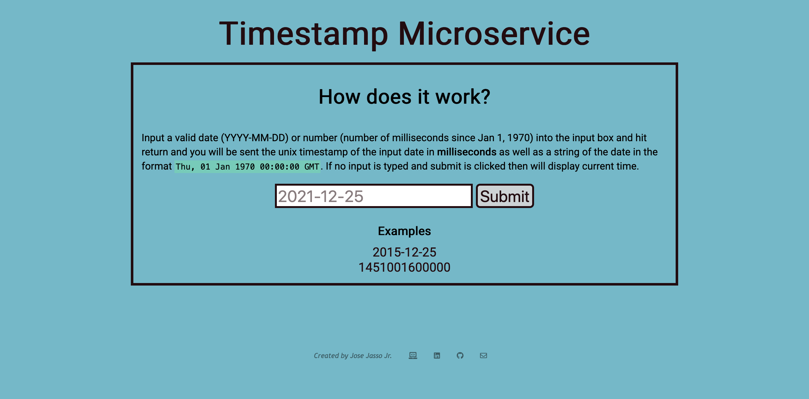

# Jose Jasso Jr. | Timestamp Microservice

A microservice designed to return a timestamp (UTC) of any date input! 

## Techs Used

[Node.js](hhttps://nodejs.org/en/) and CSS

## Preview of Site

## Link to Site
Site can be found on [https://jasso-fcc-timestamp.herokuapp.com/](https://jasso-fcc-timestamp.herokuapp.com/) 

Deployed with [Heroku](https://heroku.com/)

